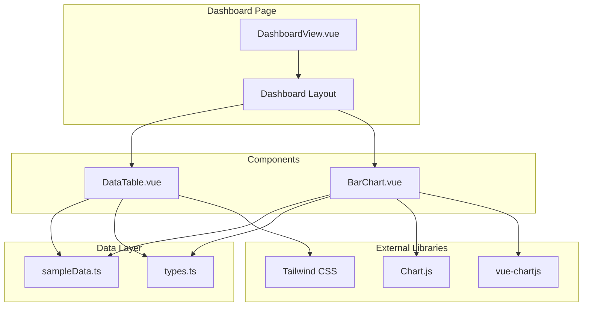

# 設計ドキュメント

## 概要

ダッシュボードページは、Vue 3 Composition API を使用して構築され、Tailwind CSS でスタイリングされ、Chart.js でチャートを描画します。コンポーネントは再利用可能で拡張可能な設計とし、TypeScript による型安全性を確保します。

## アーキテクチャ



## コンポーネントとインターフェース

### ディレクトリ構造

```
src/site/src/
├── components/
│   └── dashboard/
│       ├── DataTable.vue
│       └── BarChart.vue
├── types/
│   └── dashboard.ts
├── data/
│   └── sampleData.ts
└── views/
    └── DashboardView.vue
```

### TypeScript インターフェース

```typescript
// types/dashboard.ts

// テーブル列の定義
export interface TableColumn {
  key: string
  label: string
  width?: string
}

// テーブル行データ（ジェネリック対応）
export interface TableRow {
  [key: string]: string | number
}

// DataTable コンポーネントの props
export interface DataTableProps {
  columns: TableColumn[]
  rows: TableRow[]
  emptyMessage?: string
}

// チャートデータセット
export interface ChartDataset {
  label: string
  data: number[]
  backgroundColor?: string | string[]
  borderColor?: string | string[]
  borderWidth?: number
}

// バーチャートの props
export interface BarChartProps {
  labels: string[]
  datasets: ChartDataset[]
  title?: string
  showLegend?: boolean
}
```

### DataTable コンポーネント

```vue
<!-- components/dashboard/DataTable.vue -->
<script setup lang="ts">
import type { TableColumn, TableRow } from '@/types/dashboard'

interface Props {
  columns: TableColumn[]
  rows: TableRow[]
  emptyMessage?: string
}

withDefaults(defineProps<Props>(), {
  emptyMessage: 'データがありません'
})
</script>
```

**責務:**
- 3列のテーブルヘッダーを表示
- 行データをレンダリング
- 空状態のメッセージを表示
- Tailwind CSS でスタイリング（ホバーエフェクト含む）

### BarChart コンポーネント

```vue
<!-- components/dashboard/BarChart.vue -->
<script setup lang="ts">
import { Bar } from 'vue-chartjs'
import {
  Chart as ChartJS,
  CategoryScale,
  LinearScale,
  BarElement,
  Title,
  Tooltip,
  Legend
} from 'chart.js'
import type { BarChartProps } from '@/types/dashboard'

ChartJS.register(CategoryScale, LinearScale, BarElement, Title, Tooltip, Legend)

interface Props {
  labels: string[]
  datasets: BarChartProps['datasets']
  title?: string
  showLegend?: boolean
}

withDefaults(defineProps<Props>(), {
  title: '',
  showLegend: true
})
</script>
```

**責務:**
- Chart.js インスタンスの初期化と破棄（vue-chartjs が自動管理）
- バーチャートのレンダリング
- 軸ラベルと凡例の表示
- レスポンシブリサイズ

### DashboardView コンポーネント

```vue
<!-- views/DashboardView.vue -->
<script setup lang="ts">
import DataTable from '@/components/dashboard/DataTable.vue'
import BarChart from '@/components/dashboard/BarChart.vue'
import { tableColumns, tableRows, chartLabels, chartDatasets } from '@/data/sampleData'
</script>
```

**責務:**
- レスポンシブグリッドレイアウトの提供
- DataTable と BarChart コンポーネントの配置
- サンプルデータの注入

## データモデル

### サンプルデータ構造

```typescript
// data/sampleData.ts
import type { TableColumn, TableRow, ChartDataset } from '@/types/dashboard'

export const tableColumns: TableColumn[] = [
  { key: 'id', label: 'ID' },
  { key: 'name', label: '名前' },
  { key: 'value', label: '値' }
]

export const tableRows: TableRow[] = [
  { id: 1, name: '項目A', value: 100 },
  { id: 2, name: '項目B', value: 200 },
  { id: 3, name: '項目C', value: 150 },
  { id: 4, name: '項目D', value: 300 },
  { id: 5, name: '項目E', value: 250 }
]

export const chartLabels: string[] = ['項目A', '項目B', '項目C', '項目D', '項目E']

export const chartDatasets: ChartDataset[] = [
  {
    label: '売上',
    data: [100, 200, 150, 300, 250],
    backgroundColor: 'rgba(59, 130, 246, 0.5)',
    borderColor: 'rgb(59, 130, 246)',
    borderWidth: 1
  }
]
```


## 正確性プロパティ

*プロパティとは、システムのすべての有効な実行において真であるべき特性または動作です。プロパティは、人間が読める仕様と機械で検証可能な正確性保証の橋渡しをします。*

### Property 1: テーブル列設定の検証

*任意の*列設定配列に対して、DataTable コンポーネントは設定された数の列をレンダリングし、各列のヘッダーテキストは設定されたラベルと一致しなければならない。

**Validates: Requirements 2.1, 2.5**

### Property 2: テーブル行データのレンダリング

*任意の*行データ配列に対して、DataTable コンポーネントは配列の長さと同じ数の行をレンダリングし、各セルの値は対応する行データの値と一致しなければならない。

**Validates: Requirements 2.2**

## エラーハンドリング

### DataTable コンポーネント

| エラー条件 | 対応 |
|-----------|------|
| 空の rows 配列 | 空状態メッセージを表示 |
| 空の columns 配列 | テーブルヘッダーなしでレンダリング |
| 行データに存在しないキー | 空のセルとして表示 |

### BarChart コンポーネント

| エラー条件 | 対応 |
|-----------|------|
| 空の datasets 配列 | 空のチャートをレンダリング |
| labels と data の長さ不一致 | Chart.js のデフォルト動作に従う |
| コンポーネントアンマウント | vue-chartjs が自動的にインスタンスを破棄 |

## テスト戦略

### テストアプローチ

このプロジェクトでは、ユニットテストとプロパティベーステストの両方を使用します：

- **ユニットテスト**: 特定の例、エッジケース、エラー条件を検証
- **プロパティテスト**: すべての入力に対する普遍的なプロパティを検証

### テストフレームワーク

- **Vitest**: Vue 3 プロジェクト用のテストランナー
- **@vue/test-utils**: Vue コンポーネントのテストユーティリティ
- **fast-check**: プロパティベーステスト用ライブラリ

### プロパティベーステスト設定

- 各プロパティテストは最低100回の反復を実行
- 各テストは設計ドキュメントのプロパティを参照するコメントでタグ付け
- タグ形式: **Feature: dashboard-page, Property {number}: {property_text}**

### テストケース

#### DataTable コンポーネント

**ユニットテスト:**
- 空の rows 配列で空状態メッセージが表示される
- ホバーエフェクトのCSSクラスが適用されている

**プロパティテスト:**
- Property 1: 任意の列設定に対する列数とヘッダーテキストの検証
- Property 2: 任意の行データに対する行数とセル値の検証

#### BarChart コンポーネント

**ユニットテスト:**
- チャートデータが提供された時にチャートがレンダリングされる
- 凡例と軸ラベルが表示される
- responsive オプションが有効になっている

#### DashboardView コンポーネント

**ユニットテスト:**
- DataTable と BarChart の両方がレンダリングされる
- レスポンシブグリッドクラスが適用されている
